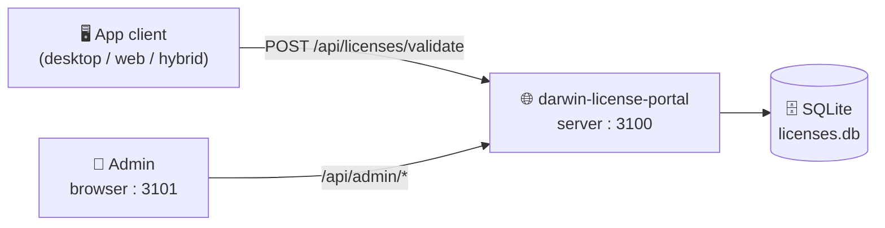
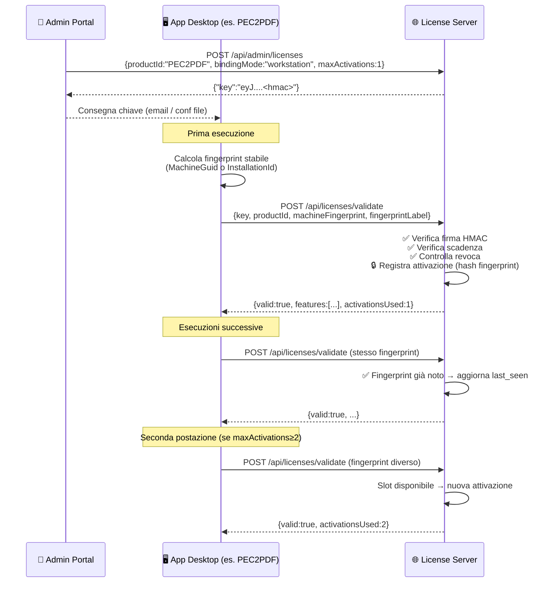

# 🔐 darWIN License Portal

> Portale centralizzato di gestione e validazione licenze per i software darWIN.
> Backend Node.js · Admin React · SQLite · Docker

---

## 📚 Indice

- [Architettura](#-architettura)
- [Come funziona una licenza](#-come-funziona-una-licenza)
- [Generare una licenza — guida rapida](#-generare-una-licenza--guida-rapida)
- [Binding e attivazione postazioni](#-binding-e-attivazione-postazioni)
  - [Devo raccogliere dati dalla macchina del cliente?](#-devo-raccogliere-dati-dalla-macchina-del-cliente)
  - [Flusso completo per licenza Desktop / Workstation](#-flusso-completo-per-licenza-desktop--workstation)
- [Modalità di vincolo (bindingMode)](#-modalità-di-vincolo-bindingmode)
- [Tipi di licenza](#-tipi-di-licenza)
- [Feature flags](#-feature-flags)
- [Formato chiave licenza](#-formato-chiave-licenza)
- [API Reference](#-api-reference)
- [Pannello Admin](#-pannello-admin)
- [Integrazione applicazioni client](#-integrazione-applicazioni-client)
- [Aggiornamento in produzione](#-aggiornamento-in-produzione)
- [Prodotti supportati](#-prodotti-supportati)

---

## 🏗 Architettura

```
darwin-license-portal/
├── server/          ← API backend  (Node.js · Express · TypeScript · SQLite)
│   └── src/
│       ├── routes/  ← endpoint pubblici e admin
│       ├── license/ ← generazione chiavi HMAC-SHA256 e logica attivazione
│       └── db/      ← schema SQLite (licenze, attivazioni, log, prodotti)
├── admin/           ← Pannello admin  (React · Vite · TypeScript)
├── docs/            ← Guide di integrazione e deployment
└── docker-compose.yml
```



---

## 🔄 Come funziona una licenza

Il ciclo di vita completo ha **4 fasi**:

```
1. GENERA        2. CONSEGNA        3. VALIDA          4. VINCOLA
─────────────    ───────────────    ───────────────    ─────────────────
Admin Panel  →   chiave opaca   →   App client      →  Portale registra
genera key       via email /        chiama validate     fingerprint e
HMAC-firmata     ticket / conf      ad ogni avvio       crea attivazione
```

> La **chiave licenza è autosufficiente**: contiene payload + firma HMAC-SHA256.
> Il portale la può verificare **senza DB**, ma usa il DB per revocare, tracciare e limitare le attivazioni.

---

## ⚡ Generare una licenza — guida rapida

1. Aprire il pannello admin `http://<server>:3101`
2. Tab **Genera**
3. Scegliere il **prodotto** (es. `PEC2PDF`)
4. Inserire **ID cliente** (es. `ACME_001`) e nome leggibile
5. Scegliere **tipo licenza**, **durata**, **utenti max**
6. Scegliere **natura app** e **vincolo** (vedi tabella sotto)
7. Cliccare **Genera licenza** → copiare la chiave e consegnarla al cliente

> 🔑 **Non serve raccogliere nessun dato dalla macchina del cliente prima di generare la chiave.**
> Il binding avviene in automatico alla prima validazione (vedi sezione successiva).

---

## 🔗 Binding e attivazione postazioni

### ❓ Devo raccogliere dati dalla macchina del cliente?

**No.** L'admin genera la chiave **senza conoscere la macchina** del cliente.
Il legame postazione-licenza avviene **automaticamente** alla prima chiamata che l'app fa a `/api/licenses/validate`.

| Chi fa cosa | Quando |
|---|---|
| **Admin** genera la chiave con `bindingMode: workstation`, `maxActivations: 1` | Prima della consegna |
| **App client** calcola un fingerprint stabile della postazione (es. MachineGuid Windows) | All'avvio |
| **App client** manda `POST /api/licenses/validate` con `machineFingerprint` | All'avvio |
| **Portale** registra l'hash del fingerprint come prima attivazione | Automatico |
| **Chiamate successive** dallo stesso fingerprint → accettate | Automatico |
| **Fingerprint nuovo** (seconda postazione) → consuma un altro slot fino a `maxActivations` | Automatico |
| Superato `maxActivations` → risposta `ACTIVATION_LIMIT_EXCEEDED` | Automatico |

---

### 🔁 Flusso completo per licenza Desktop / Workstation



---

## 🔒 Modalità di vincolo (bindingMode)

| `bindingMode` | Default per | Fingerprint atteso | Comportamento |
|---|---|---|---|
| `workstation` | `desktop` | MachineGuid, SID, InstallationId della postazione Windows | Lega la licenza alla singola macchina |
| `server` | `hybrid` | Hostname, UUID VM, identificativo servizio | Lega al server o alla VM che ospita il prodotto |
| `tenant` | `web` | TenantId, dominio, deployment-id | Lega all'istanza o al cliente nel SaaS |
| `none` | — | Non richiesto | Nessun vincolo fisico, solo firma e scadenza |

> 💡 Il portale salva solo l'**hash HMAC del fingerprint**, mai il valore in chiaro.
> L'hash è calcolato come `HMAC-SHA256(productId + licenseKey + bindingMode + fingerprint, LICENSE_SECRET)`.

---

## 🏷 Tipi di licenza

| Tipo | Durata default | Utenti default | Feature default |
|---|---|---|---|
| `trial` | 30 giorni | 1 | `convert` |
| `starter` | 365 giorni | 1 | `convert` |
| `professional` | 365 giorni | 5 | `convert, protocol, update` |
| `enterprise` | Perpetua | 25 | `convert, protocol, update, multi_user, priority_support` |

---

## 🎛 Feature flags

Il campo `features` nella licenza abilita funzionalità specifiche nell'app client.

| Feature | Abilita |
|---|---|
| `convert` | Conversione base (funzione principale) |
| `protocol` | Bridge protocollo o protocollazione documenti |
| `update` | Aggiornamenti automatici gestiti |
| `multi_user` | Uso su più postazioni o utenti |
| `priority_support` | Flag SLA / supporto prioritario |

> Le app client devono controllare le **singole feature**, non solo il `licenseType`.

---

## 🔑 Formato chiave licenza

```
<base64url(payload_json)>.<base64url(hmac-sha256)>
```

**Payload JSON:**

```json
{
  "productId":       "PEC2PDF",
  "customerId":      "ACME_001",
  "licenseType":     "professional",
  "applicationType": "desktop",
  "bindingMode":     "workstation",
  "issuedAt":        1748000000,
  "expiresAt":       1779536000,
  "maxUsers":        5,
  "maxActivations":  1,
  "features":        ["convert", "protocol", "update"]
}
```

> `expiresAt: null` = licenza perpetua.
> La firma usa `HMAC-SHA256` con la variabile d'ambiente `LICENSE_SECRET` (≥ 32 caratteri).
> La verifica è **timing-safe** (`crypto.timingSafeEqual`).

---

## 📡 API Reference

### Endpoint pubblici (chiamati dalle app client)

| Metodo | Path | Descrizione |
|---|---|---|
| `POST` | `/api/licenses/validate` | Valida una chiave, verifica firma/scadenza/revoca, registra attivazione |
| `GET` | `/api/licenses/:key/status` | Stato pubblico di una licenza (senza log) |
| `GET` | `/api/health` | Health check del servizio |

#### `POST /api/licenses/validate` — Body

```json
{
  "key":              "eyJ...",
  "productId":        "PEC2PDF",
  "applicationType":  "desktop",
  "machineFingerprint": "installation-id-stabile",
  "fingerprintLabel": "PC-UFFICIO-01"
}
```

> `fingerprint`, `machineFingerprint`, `installationId`, `instanceId` sono alias equivalenti.

#### Risposta successo

```json
{
  "valid":           true,
  "productId":       "PEC2PDF",
  "customerId":      "ACME_001",
  "licenseType":     "professional",
  "applicationType": "desktop",
  "bindingMode":     "workstation",
  "expiresAt":       "2027-01-15T00:00:00.000Z",
  "daysLeft":        224,
  "maxUsers":        5,
  "maxActivations":  1,
  "activationsUsed": 1,
  "features":        ["convert", "protocol", "update"]
}
```

#### Codici di errore

| HTTP | `error` | Causa | Cosa fare nel client |
|---|---|---|---|
| `400` | `INVALID_REQUEST` | Body malformato | Errore tecnico, bloccare |
| `400` | `FINGERPRINT_REQUIRED` | Licenza vincolata, fingerprint mancante | Calcolare e inviare fingerprint |
| `402` | `LICENSE_EXPIRED` | Licenza scaduta | Mostrare rinnovo, disabilitare funzioni premium |
| `403` | `INVALID_SIGNATURE` | Chiave alterata o secret cambiato | Richiedere nuova licenza |
| `403` | `MALFORMED_KEY` | Formato chiave non valido | Richiedere reinserimento |
| `403` | `WRONG_PRODUCT` | Licenza di un altro prodotto | Bloccare uso |
| `403` | `WRONG_APPLICATION_TYPE` | Licenza per un'altra natura app | Bloccare, verificare config |
| `403` | `ACTIVATION_LIMIT_EXCEEDED` | Troppe postazioni attivate | Revocare un'attivazione vecchia o ampliare |
| `403` | `ACTIVATION_REVOKED` | Postazione revocata manualmente | Bloccare su quella macchina |
| `403` | `LICENSE_REVOKED` | Licenza revocata nel portale | Bloccare immediatamente |

---

### Endpoint Admin (richiede `Authorization: Bearer <jwt>`)

| Metodo | Path | Descrizione |
|---|---|---|
| `POST` | `/api/admin/login` | Login admin → rilascia JWT |
| **Prodotti** | | |
| `GET` | `/api/admin/products` | Catalogo prodotti licenziabili |
| `POST` | `/api/admin/products` | Crea nuovo prodotto |
| `PUT` | `/api/admin/products/:id` | Modifica prodotto |
| `DELETE` | `/api/admin/products/:id` | Archivia prodotto |
| **Licenze** | | |
| `POST` | `/api/admin/licenses` | Genera nuova chiave licenza |
| `GET` | `/api/admin/licenses` | Elenco licenze (filtri: `productId`, `customerId`, `revoked`) |
| `PUT` | `/api/admin/licenses/:key` | **[nuovo]** Modifica metadati licenza |
| `PUT` | `/api/admin/licenses/:key/revoke` | Revoca licenza (soft-delete, storico conservato) |
| `DELETE` | `/api/admin/licenses/:key` | **[nuovo]** Elimina definitivamente licenza dal DB |
| **Attivazioni** | | |
| `GET` | `/api/admin/licenses/:key/activations` | Elenco postazioni/istanze attivate |
| `PUT` | `/api/admin/licenses/:key/activations/:id/revoke` | Revoca una singola attivazione (libera uno slot) |
| **Log & Stats** | | |
| `GET` | `/api/admin/licenses/:key/log` | Log validazioni per licenza |
| `GET` | `/api/admin/stats` | Statistiche generali |

> **Revoca vs Elimina**: `PUT …/revoke` disabilita la licenza mantenendo lo storico e i log (consigliato).
> `DELETE` cancella fisicamente la riga dal DB — usare solo per correzioni o ambienti di test.

---

## 🖥 Pannello Admin

Accessibile su `http://<server>:3101`.

| Sezione | Funzioni |
|---|---|
| **Dashboard** | KPI (totale, attive, in scadenza, revocate, validazioni oggi), prodotti mix, ultime licenze generate |
| **Licenze** | Tabella con filtri per prodotto/stato/tipo, dettaglio laterale, **Modifica**, **Revoca**, **Elimina** |
| **Genera** | Wizard guidato per nuova licenza, selezione piano, feature picker, copia chiave |
| **Prodotti** | Catalogo prodotti licenziabili, gestione ID, vincoli default, feature default |

---

## 🔌 Integrazione applicazioni client

Guida completa → [docs/client-integration.md](docs/client-integration.md)

### Riepilogo in 5 punti

1. **Non generare mai chiavi lato client** — solo il portale conosce `LICENSE_SECRET`.
2. **Chiamare `POST /api/licenses/validate`** all'avvio e ogni 24 ore.
3. **Calcolare il fingerprint localmente** (MachineGuid, InstallationId o simili) e inviarlo nel campo `machineFingerprint`. Non cambiarlo ad ogni avvio.
4. **Salvare la cache** dell'ultimo risultato valido per tollerare brevi assenze di rete (max 3 giorni).
5. **Non ignorare** `LICENSE_REVOKED`, `INVALID_SIGNATURE`, `WRONG_PRODUCT` nemmeno offline.

### Fingerprint consigliati per tipo app

| Tipo | Fingerprint consigliato |
|---|---|
| `desktop` Windows | `MachineGuid` dal registro (`HKLM\SOFTWARE\Microsoft\Cryptography`) oppure un `installation-id` creato al primo avvio |
| `hybrid` (Delphi/uniGUI) | Hostname + UUID server o un file ID creato all'installazione |
| `web` / SaaS | `tenantId` interno, dominio del cliente o deployment-id |

---

## 🚀 Aggiornamento in produzione

Guida completa → [docs/aggiornamento-produzione.md](docs/aggiornamento-produzione.md)

Il portale gira in `/opt/darwin-license-portal`. Sequenza rapida:

```bash
cd /opt/darwin-license-portal
cp .env /root/darwin-license-portal.env.backup
git fetch origin
git reset --hard origin/main
cp /root/darwin-license-portal.env.backup .env
docker compose up -d --build
```

---

## 📦 Prodotti supportati

| Prodotto | ID prodotto | Tipo app | Binding default |
|---|---|---|---|
| pec-to-pdf-converter | `PEC2PDF` | `desktop` | `workstation` |
| *(altri prodotti darWIN)* | *(da aggiungere nel pannello)* | — | — |

---

## 🗂 Documentazione aggiuntiva

| Documento | Contenuto |
|---|---|
| [docs/client-integration.md](docs/client-integration.md) | Guida completa per integrare un prodotto client |
| [docs/aggiornamento-produzione.md](docs/aggiornamento-produzione.md) | Procedura di aggiornamento su server di produzione |

---

<details>
<summary>🗃 Schema database (riferimento)</summary>

```sql
-- Licenze generate dall'admin
CREATE TABLE licenses (
  key TEXT UNIQUE,          -- chiave opaca base64url.hmac
  product_id TEXT,
  customer_id TEXT,
  customer_name TEXT,
  license_type TEXT,        -- trial|starter|professional|enterprise
  application_type TEXT,    -- desktop|hybrid|web
  binding_mode TEXT,        -- none|workstation|server|tenant
  issued_at INTEGER,        -- unix timestamp
  expires_at INTEGER,       -- unix timestamp, NULL = perpetua
  max_users INTEGER,
  max_activations INTEGER,
  features TEXT,            -- JSON array
  revoked INTEGER DEFAULT 0,
  notes TEXT
);

-- Postazioni/istanze attivate
CREATE TABLE license_activations (
  license_key TEXT,
  fingerprint_hash TEXT,    -- HMAC dell'ID macchina, mai in chiaro
  fingerprint_label TEXT,   -- nome leggibile (es. "PC-UFFICIO-01")
  first_seen_at INTEGER,
  last_seen_at INTEGER,
  last_ip TEXT,
  revoked INTEGER DEFAULT 0
);

-- Log ogni chiamata a /validate
CREATE TABLE validation_log (
  license_key TEXT,
  result TEXT,              -- OK | FAILED
  reason TEXT,
  validated_at INTEGER
);
```

</details>
  "expiresAt": "2027-01-15T00:00:00Z",
  "daysLeft": 224,
  "features": ["convert","protocol","update"],
  "maxUsers": 5,
  "maxActivations": 1,
  "activationsUsed": 1
}
```

## Stack tecnologico

- **Server:** Node.js 20, Express, TypeScript, Zod, SQLite con `better-sqlite3`
- **Admin UI:** React 18, Vite, TypeScript
- **Auth admin:** JWT
- **Deployment:** Docker Compose
- **Test:** Vitest, Supertest

## Setup sviluppo

```bash
# Server
cd server
npm install
cp .env.example .env   # imposta LICENSE_SECRET e DATABASE_URL
npm run dev            # avvia su http://localhost:3100

# Admin UI
cd admin
npm install
npm run dev            # avvia su http://localhost:5173
```

## Deploy Docker Compose

Copiare `.env.example` in `.env` nella root del progetto e impostare valori reali:

```bash
LICENSE_SECRET=<secret-64-char>
ADMIN_JWT_SECRET=<secret-64-char>
ADMIN_USERNAME=admin
ADMIN_PASSWORD=<password-admin>
CORS_ORIGIN=http://<server-ip-o-dominio>
```

Poi avviare:

```bash
docker compose up -d --build
```

Servizi esposti:

| Servizio | Porta | URL locale |
|----------|-------|------------|
| Admin UI | `80` | `http://localhost` |
| API server | `3100` | `http://localhost:3100/api/health` |

Il database SQLite usa il volume Docker `license_data`; non cancellarlo durante gli aggiornamenti.

## Variabili d'ambiente (server)

| Variabile | Descrizione | Esempio |
|-----------|-------------|---------|
| `PORT` | Porta API | `3100` |
| `LICENSE_SECRET` | Segreto HMAC-SHA256 (min 32 char) | `change-me-in-production-xxxxx` |
| `DATABASE_URL` | SQLite path o Postgres URL | `./data/licenses.db` |
| `ADMIN_JWT_SECRET` | Segreto JWT admin | `another-secret-xxxxx` |
| `ADMIN_USERNAME` | Username admin iniziale | `admin` |
| `ADMIN_PASSWORD` | Password admin iniziale | `change-me-before-first-login` |
| `TRIAL_DAYS` | Durata trial in giorni | `30` |

## Sicurezza

- `LICENSE_SECRET` non viene mai distribuito nei prodotti client
- Il prodotto invia solo la chiave opaca al server per validarla
- Per licenze vincolate il client invia un fingerprint gia normalizzato/hashato; il server lo salva come hash HMAC
- Rate limiting su `/api/licenses/validate` (max 10 req/min per IP)
- HTTPS obbligatorio in produzione
- Log di ogni validazione con timestamp e IP

## Roadmap

- [x] Specifiche ADR iniziali
- [x] Server API core (validate + admin generate)
- [x] Modello database SQLite
- [x] Admin UI base (CRUD licenze)
- [x] Documentazione integrazione client
- [ ] Integrazione pec-to-pdf-converter (LicenseGuard middleware)
- [ ] Docker Compose deploy
- [ ] HTTPS + dominio
- [ ] Dashboard statistiche utilizzo
